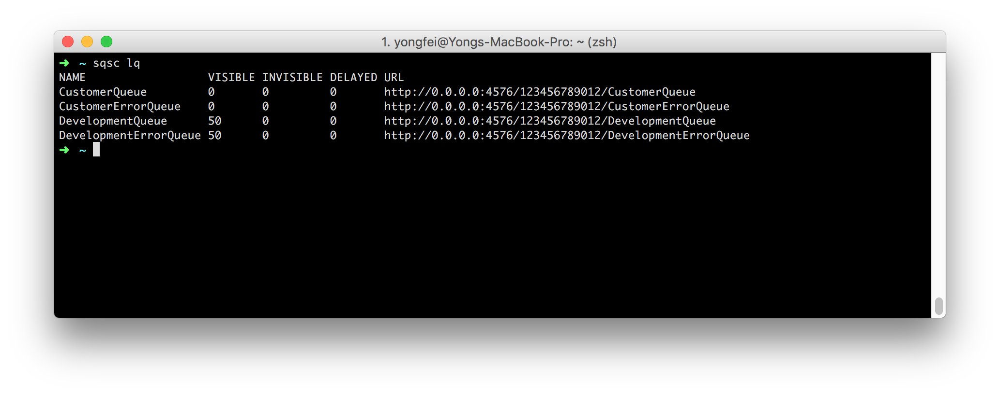
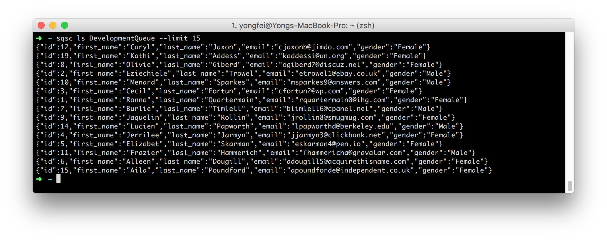
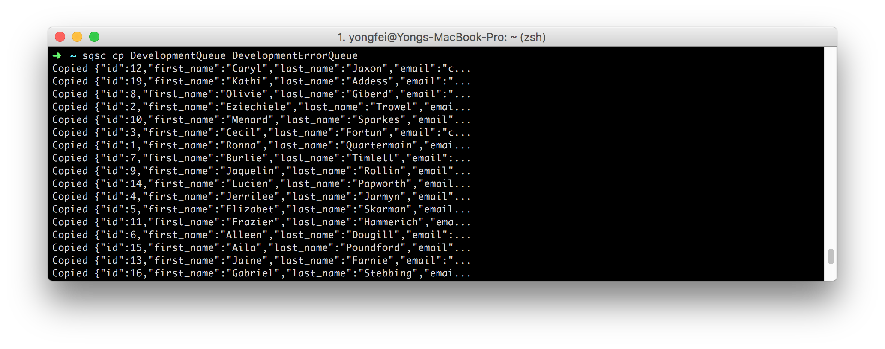
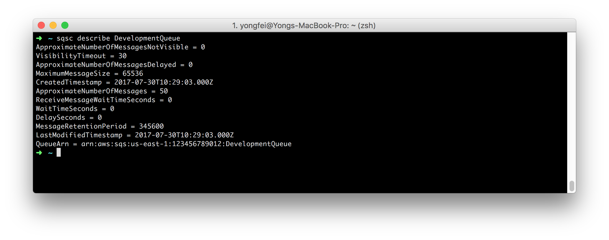
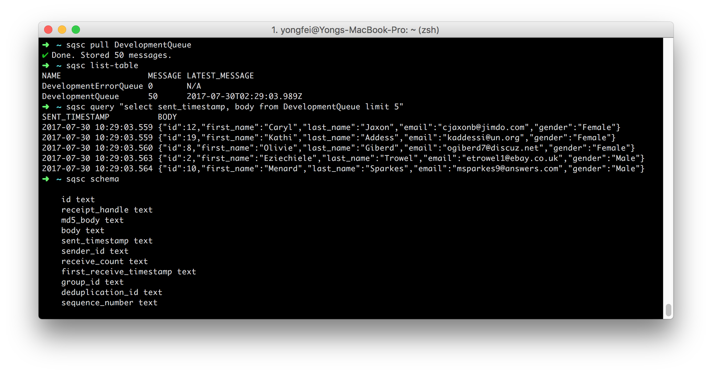

# sqsc
[](https://badge.fury.io/js/sqsc)
[](https://travis-ci.org/yongfei25/sqsc) 

`sqsc` is a command line tool for interacting with AWS SQS queues.

## Installation
```bash
npm install -g sqsc
```

## Features
### List queues: `sqsc lq [queue-prefix]`


### List messages: `sqsc ls <queue-name>`
_Options:_
- `timeout`: Visibility timeout for messages received (Default = 30). You might need to increase this if the queue has a lot of messages to prevent reading the same message.
- `timestamp`: Display timestamp.
- `limit`: Maximum number of messages to list.



### Copy all messages to queue: `sqsc cp <from-queue-name> <to-queue-name>`
### Move all messages to queue: `sqsc mv <from-queue-name> <to-queue-name>`
_Options:_
- `timeout`: Visibility timeout for messages received (Default = 30).



### Describe queue: `sqsc describe <queue-name>`


### SQL query: `sqsc query "SELECT body FROM <queue-name> WHERE body LIKE '%user%'"`
#### 1. Run `sqsc pull <queue-name>` to store messages in local sqlite database.
_Options:_
- `timeout`: Visibility timeout for messages received (Default = 30).

#### 2. To query, run `sqsc query <sql-query>`. Internally, `sqsc` will try to guess the queue name in the SQL.
_Options:_
- `hide-headers`: Do not show column headers. (Eg: you want to use body with JSON parser like `jq`)

#### 3. To see what queues are available for query, run `sqsc list-table`.
#### 4. To see the table schema, run `sqsc schema`.


#### 5. To query fields in JSON, use `json_extract` function in `sqlite`.
```bash
$ sqsc query "select json_extract(body, '$.gender') gender, count(*) from DevelopmentQueue group by 1"

GENDER COUNT(*)
Female 24
Male   26
```

## Message `visibility timeout` and `max receive count`
- When a message is received by `sqsc`, the `visibility timeout` is set to `30s` by default. You can use the `--timeout` parameter to change it.
- `sqsc` keeps the `receipt handle` for all messages to reset their `visibility timeout` at the end of the command.
- If `sqsc` receive the same message more than once, it will only use the first message. (It checks `message ID`)
- `receive count` of message increases as usual for each receive. Message goes into `dead letter queue` when it hits `max receive count`.
- The following commands receive message thus have the effects mentioned above:
  - `ls`
  - `mv`
  - `cp`
  - `pull`

## Unsupported Features
- Server side encryption
- FIFO queue

## Development Setup
```bash
# Install dependencies
npm install

# Running tests
npm test

# Starting localstack
export TMPDIR=/private$TMPDIR # MacOS only
docker-compose up -d

# Populating queues and messages for Development
export LOCALSTACK=1
tsc -p .
bin/populate-dev.js
```
