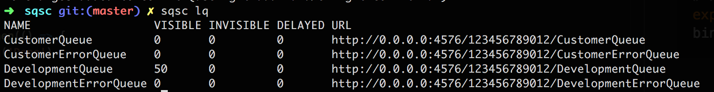
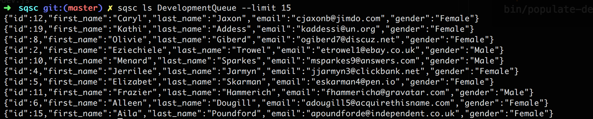
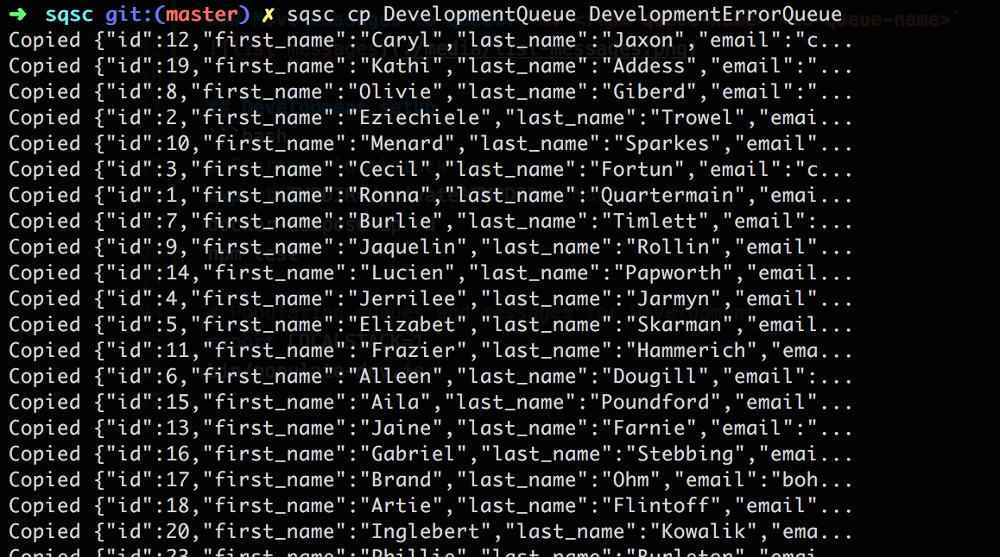

# sqsc
<!-- [](https://travis-ci.org/yongfei25/sqsc) -->

`sqsc` is a command line tool for interacting with SQS queues.

## Features
### List queues: `sqsc lq [queue-prefix]`


### List messages: `sqsc ls <queue-name>`


### Copy messages to queue: `cp <from-queue-name> <to-queue-name>`
### Move messages to queue: `mv <from-queue-name> <to-queue-name>`


## Development setup
```bash
# Starting localstack
export TMPDIR=/private$TMPDIR # MacOS only
docker-compose up -d
npm test

# Populating queues and messages for Development
export LOCALSTACK=1
bin/populate-dev.js
```
